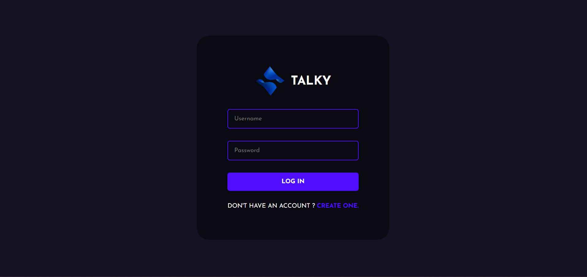
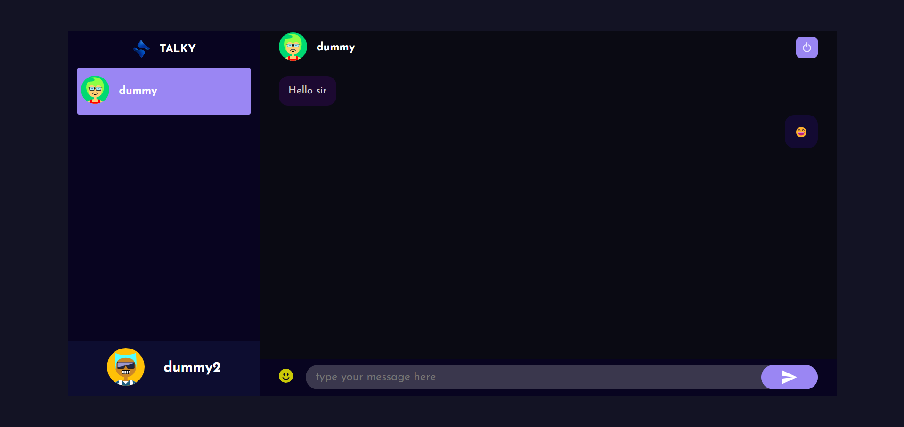
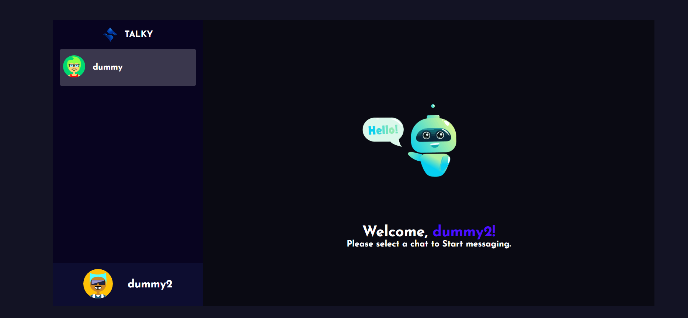

# Real-Time Chat Application

## Summary

This real-time chat application is designed to facilitate seamless communication between users by providing an interface where they can send and receive messages instantly. Built with MongoDB for message storage, Node.js and Express.js for backend processing, React.js for the user interface, and WebSocket for real-time communication, this application ensures a dynamic and responsive chat experience.

## Features

- **Real-Time Messaging**: Users can send and receive messages in real-time using WebSocket technology.
- **User Authentication**: Secure login and registration system to manage user accounts.
- **User List**: Display online users and enable conversations with them.
- **Message History**: Store and retrieve past messages using MongoDB.
- **Responsive Design**: A clean and modern user interface that adapts to various screen sizes.

## Installation

1. Clone the repository:
    ```bash
    git clone https://github.com/yourusername/real-time-chat-app.git
    ```
2. Navigate to the project directory:
    ```bash
    cd real-time-chat-app
    ```
3. Install the frontend dependencies:
    ```bash
    cd frontend
    npm install
    ```
4. Install the backend dependencies:
    ```bash
    cd ../backend
    npm install
    ```
5. Configure environment variables in both the frontend and backend directories. See `.env.example` files for required variables.

6. Start the backend server:
    ```bash
    cd ../backend
    npm start
    ```

7. Start the frontend development server:
    ```bash
    cd ../frontend
    npm start
    ```

## Usage

1. Open the application in your browser. Typically, the frontend will be available at `http://localhost:3000`.
2. Register a new user or log in with existing credentials.
3. Start chatting with other users by selecting them from the user list.

## Screenshots

### Login Page


### Chat Interface


### User List


## Technologies Used

- **Frontend**: React.js, Tailwind CSS
- **Backend**: Node.js, Express.js
- **Database**: MongoDB
- **Real-Time Communication**: WebSocket


## Acknowledgments

- **React**: For the component-based architecture.
- **Node.js** and **Express.js**: For the robust server-side functionality.
- **MongoDB**: For scalable data storage.
- **WebSocket**: For enabling real-time communication.

For any issues or feedback, please refer to the [mail](ekanshaggarwal11103@gmail.com).

---

